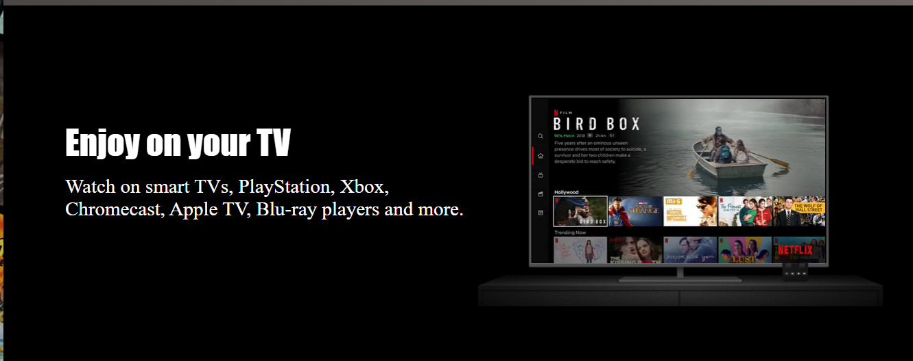
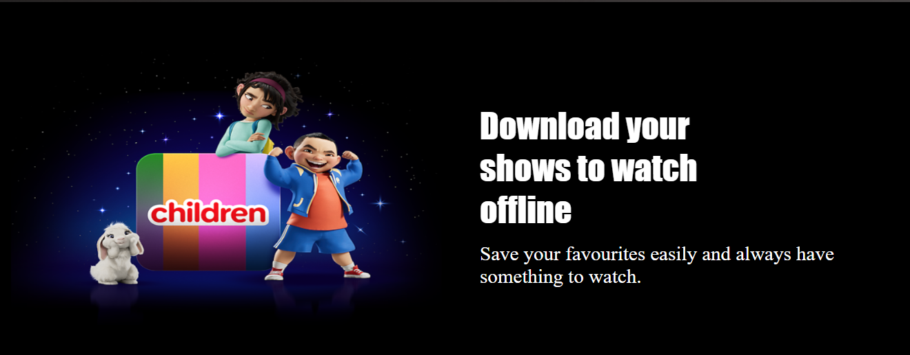
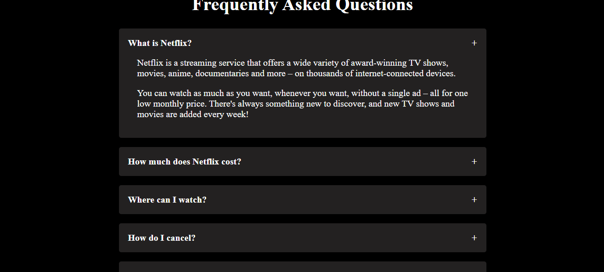
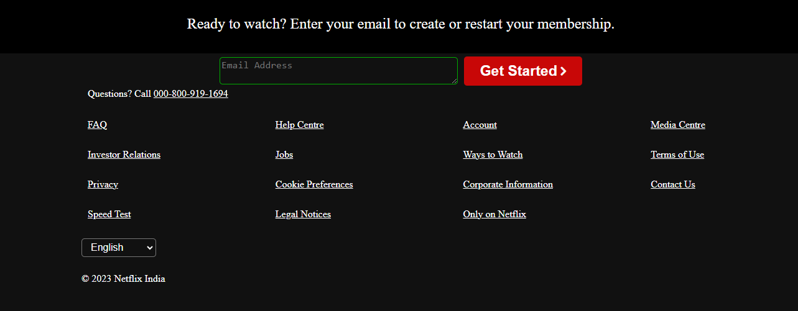

# 🌟 Bharath Intern Task 3

🚀 **Project Description:**  
This repository contains Task 3 of the Bharath Internship, which showcases a web-based project developed using HTML, CSS, and JavaScript. It demonstrates [mention what the project does].

## 📸 Screenshots  

### 🏠 Homepage  

### 🔹 Another Section  

### 📊 More Screenshots  
  
  
  
  

## ⚙️ Technologies Used  
- HTML  
- CSS  
- JavaScript  

